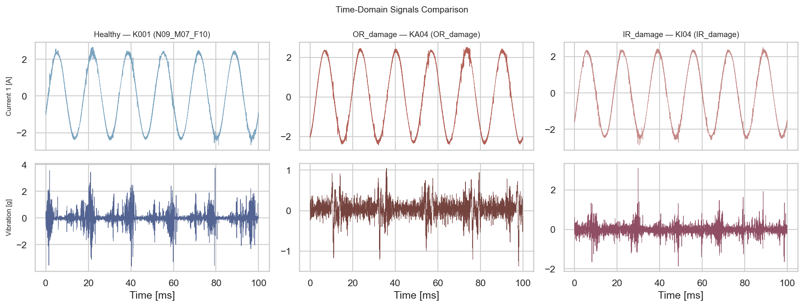
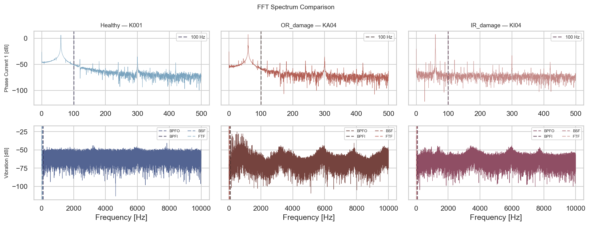
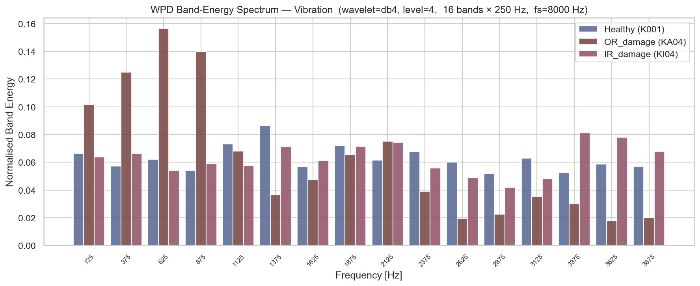
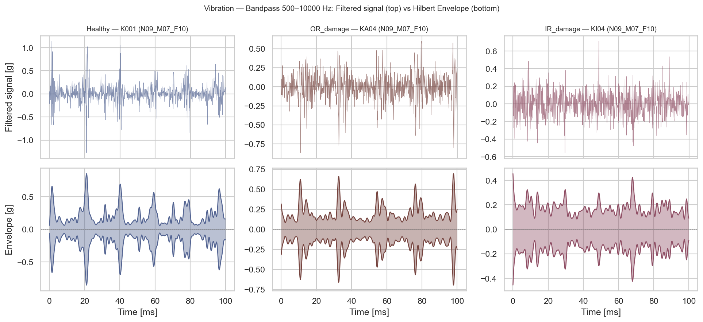
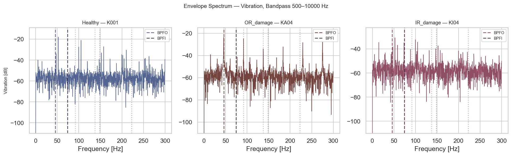
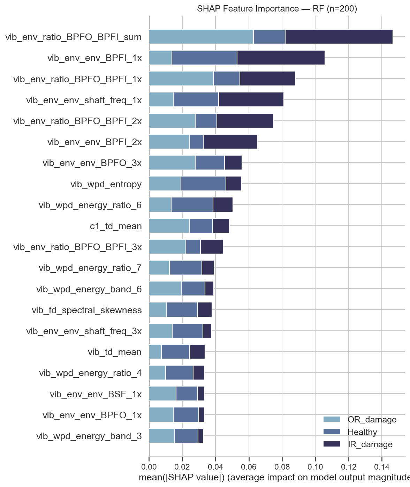

# 轴承故障诊断（电机振动与电流信号）

基于 **CRISP-DM** 方法论的端到端预测性维护案例研究。实现电驱动系统中的无传感器轴承故障检测——从原始信号到特征工程，到基于传统机器学习的异常检测方法，再到云端部署。


---

## 业务理解

**电驱动系统常见故障信号特征：**

| 部件 | 所属系统 | 故障类型 | 振动信号表现 | 电流信号表现 |
|---|---|---|---|---|
| 轴承 | 电机/传动系统 | 表面剥落/裂纹 | 轴承特征频率（BPFO/BPFI），包络分析最有效 | 不明显 |
| 转子 | 电机 | 不平衡 | 1倍转频能量突出 | 不明显 |
| 转子 | 电机 | 断条 | 转频谐波增大，不太明显 | 工频两侧出现 ±2sf 边带，非常明显 |
| 定子 | 电机 | 匝间短路 | 不明显 | 三相电流不对称，特定次数谐波 |
| 气隙 | 电机 | 静态偏心 | 转频相关谐波 | 特定次数谐波 |
| 气隙 | 电机 | 动态偏心 | 转频相关谐波 | 旋转边带 |
| 联轴器 | 传动系统 | 不对中 | 2倍转频突出，轴向振动大 | 不明显 |
| 齿轮 | 传动系统 | 磨损/断齿 | 啮合频率（转速×齿数）及谐波 | 不明显 |
| 轴 | 传动系统 | 弯曲/裂纹 | 1倍和2倍转频异常 | 不明显 |

> 本项目聚焦于**轴承故障**。

**为什么重要。**
问题：*"这个轴承需要检修吗？"*

未检测到的轴承故障会导致计划外停机，而过多误报则会造成不必要的停机维修成本。漏报与误报的代价需要同时权衡，因此使用 **F1** 作为核心指标。


**检测什么？**
轴承故障会在振动和电流信号中产生冲击性脉冲。振动信号的包络分析是最有效的检测手段；电流信号对轴承故障不敏感（边带极弱）。

目标1是将信号分类为：健康（Healthy）、外圈损伤（OR damage）或内圈损伤（IR damage）。

目标2是将信号分类为：健康（Healthy）、损伤（damage）。


**预先定义的成功指标：**
- 多分类：在未见过的轴承上 F1-macro ≥ 0.85
- 二分类故障检测：有标签场景下，在未见过的轴承上， F1 ≥ 0.95（兼顾虚警与漏报）
- 二分类故障检测：无标签场景下，在未见过的轴承上， F1 ≥ 0.80，验证故障特征确为真实异常

---

## 数据理解

- **数据来源**：帕德博恩大学 KAt-DataCenter — [Zenodo DOI 10.5281/zenodo.15845309](https://zenodo.org/records/15845309)
- **论文**：Lessmeier et al., PHME 2016
- **信号**：双相电流（64 kHz）+ 振动加速度（64 kHz）
- **轴承**：32 组实验 — 6 个健康、12 个人工损伤、14 个实际损伤
- **工况**：速度 / 扭矩 / 径向力的 4 种组合
- **类别分布**：约 19% 健康、约 40% 外圈损伤、约 41% 内圈损伤


**主要数据挑战：**
- 同一轴承在不同工况下即使健康也会产生不同的信号分布 → 特征提取前按工况进行 z-score 标准化
- 标签可用（监督任务），但无监督方法对比验证了故障特征确实是真正的异常，而非学习到的类别边界伪影

---

## 特征工程

**工况设置** — 数据集覆盖 4 种固定设置，每种为轴速、负载扭矩与径向力的组合：

| 设置代码 | 转速 | 扭矩 | 径向力 |
|---|---|---|---|
| N15_M07_F10 | 1500 rpm | 0.7 Nm | 1000 N |
| N09_M07_F10 | 900 rpm | 0.7 Nm | 1000 N |
| N15_M01_F10 | 1500 rpm | 0.1 Nm | 1000 N |
| N15_M07_F04 | 1500 rpm | 0.7 Nm | 400 N |

同一轴承在不同工况下，即使健康也会产生不同的信号幅值和频谱内容——在没有标准化的情况下，用 N15 训练的模型会将 N09 信号误判为异常。
在任何特征计算之前，通过两阶段流水线来解决这一问题。

**第一阶段 — 信号级 z-score 标准化（特征提取前）**

每个原始信号使用 *仅训练轴承* 数据、按工况分组计算的均值和标准差进行标准化：

```
sig_norm(t) = ( sig(t) − μ_cond ) / σ_cond
```

`μ_cond` 和 `σ_cond` 仅在训练数据上估计——不会有测试集统计信息泄漏。
由于故障能量占总信号功率不足 10%，基线本质上是无故障的，可以推广到未见过的轴承。
经过此步骤后，较高的 RMS 值反映的是真实的机械异常，而非高负载工况。

**第二阶段 — 轴阶次转换（特征提取后）**

频谱特征（频谱质心、峰值频率、频谱方差）以 Hz 为单位，且与轴速线性相关。
除以轴频 `f_shaft = rpm / 60` 将其转换为无量纲轴阶次，使相同故障模式无论运行速度如何都产生相同的特征值。
BPFO/BPFI 包络幅值也在每个文件对应的速度校正特征频率处单独计算。

| 特征组 | 原始单位 | 第二阶段后 |
|---|---|---|
| 频谱质心、峰值频率、频谱标准差 | Hz | 轴阶次（÷ f_shaft） |
| 频谱方差 | Hz² | 阶次²（÷ f_shaft²） |
| 包络幅值、时域统计量、WPD 比值 | 无量纲 | 不变 |

**DSP 特征提取** ：

| 域 | 特征 | 测量内容 |
|---|---|---|
| 时域 | 均方根值（RMS） | 总体信号能量 — 轴承退化时第一个上升的指标 |
| 时域 | 峰值（Peak） | 最大绝对幅值 — 对突发大瞬变敏感 |
| 时域 | 峰度（Kurtosis） | 信号的冲击性 — 健康轴承 ≈ 3，故障轴承 > 10；最佳早期故障指标 |
| 时域 | 波峰因数（Crest factor） | Peak ÷ RMS — 当低背景中出现孤立尖峰时上升 |
| 时域 | 偏度（Skewness） | 幅值分布的不对称性 — 健康信号接近对称 |
| 时域 | 波形因数（Shape factor） | RMS ÷ 均值绝对值 — 衡量波形相对于其平均值的"尖锐程度" |
| 时域 | 冲击因数（Impulse factor） | Peak ÷ 均值绝对值 — 放大单个大冲击；对早期点蚀故障敏感 |
| 频域 | 频谱质心（Spectral centroid） | 加权平均频率 — 故障能量移至更高频率时向上偏移 |
| 频域 | PSD （Power Spectral Density）频带能量 | 特定频段的信号功率 — 表示为比值时与负载无关 |
| 频域 | 主频（Dominant frequency） | 最大能量处的频率 — 检测故障引入的新周期分量 |
| 频域 | WPD （Wavelet Packet Decomposition）子带能量 | 等宽频率子带中的信号能量 — 无需精确缺陷频率即可捕获故障能量在频谱上的分布方式 |
| 包络（仅振动） | BPFO/BPFI 幅值（1×–3× 谐波） | 解调包络中各缺陷频率的强度 — 直接量化故障冲击重复率 |
| 包络（仅振动） | 频率间比值（BPFO/BPFI） | 外圈与内圈能量之比 — 区分外圈损伤与内圈损伤类型的主要鉴别器 |











**轴承缺陷频率（SKF 6203 @ 1500 rpm，轴频 25 Hz）：**

| 缩写 | 全称 | 频率 | 物理含义 |
|---|---|---|---|
| BPFO | 外圈球通过频率 | 76.1 Hz | 滚动体撞击外圈缺陷的频率 |
| BPFI | 内圈球通过频率 | 123.9 Hz | 滚动体撞击内圈缺陷的频率 |

**计算公式：**

$$BPFO = \frac{N}{2} \cdot f_n \cdot \left(1 - \frac{d}{D}\cos\theta\right)$$

$$BPFI = \frac{N}{2} \cdot f_n \cdot \left(1 + \frac{d}{D}\cos\theta\right)$$

其中：N = 滚珠个数，$f_n$ = 转频（转/秒），d = 滚珠直径，D = 节圆直径（滚珠中心所在圆的直径），θ = 接触角


**关键 DSP 技术：**

| 技术 | 全称 | 用途 |
|---|---|---|
| FFT / PSD | 快速傅里叶变换 / 功率谱密度 | 将时域信号转换为频谱；识别主要故障频率 |
| WPD | 小波包分解 | 将信号分割为等宽频率子带进行能量分析 |
| Hilbert 变换 | — | 提取信号包络；揭示故障冲击的重复率 |
| STFT | 短时傅里叶变换 | 滑动 FFT 窗口 — 追踪频率内容随时间的变化 |
| CWT | 连续小波变换 | 多分辨率时频图；同时解析快速瞬变和缓慢趋势 |

**特征选择**：使用随机森林和中位数重要性阈值的 `SelectFromModel`。


---

## 算法建模

**分割策略** — 轴承感知，防止数据泄漏：
`StratifiedGroupKFold` 确保没有轴承同时出现在训练集和测试集中。在训练中见过轴承 K001 的模型不能在验证时再次看到 K001 信号——否则它会记忆轴承特有的噪声，而非学习可推广到未见资产的故障模式。以轴承 ID 为 group，强制每个折的验证集只包含训练中从未出现的轴承，评估的才是真正的泛化能力。

**关于时间序列分割：** 本数据集每个 `.mat` 文件是独立的稳态采集，各轴承损伤状态固定，不存在随时间演变的退化过程，因此不需要按时间顺序分割。但在 **run-to-failure** 类数据集（记录轴承从健康到损坏的完整退化过程）中，必须用早期数据训练、晚期数据测试——随机分割会让模型在训练时"见到未来"的退化状态，导致测试集评估虚高，部署后立即失效。sklearn 的 `TimeSeriesSplit` 专门处理这种场景：每个折的验证集严格在训练集的时间之后，训练窗口随折数递增，复现真实的滚动预测过程。


**模型选择：**

| 标签可用性 | 模型 | 理由 |
|---|---|---|
| 有标签 | RF、GBT、XGBoost | 监督学习，完整 3 类和二分类 |
| 无标签 | Isolation Forest + PCA | 单类，仅在健康数据上训练；通过异常分数检测故障 |
| 无标签 | One-Class SVM + PCA | 核方法学习健康分布的紧致边界；与 IF 互补，精确率更高 |
| 无标签（组合） | AND 融合（IF ∩ OC-SVM） | 两者同时判为故障才输出故障——大幅压低虚警，适用于误报代价高的场景 |

**sklearn Pipeline**：
所有预处理（StandardScaler）和模型步骤都包装在单个 `Pipeline` 对象中。
缩放器仅在每个 CV 折的训练数据内拟合——不可能发生泄漏。

**超参数调整**：RF、GBT、XGBoost 使用 `RandomizedSearchCV`（30 次迭代，3 折内部 CV）。
Isolation Forest 和 One-Class SVM 使用手动 `ParameterGrid` + `StratifiedGroupKFold`（无监督估计器不接受 `fit` 中的 `y`，因此不能直接使用 `GridSearchCV`）。

---

## 结果评估


**二分类结果 — 健康 vs 故障**（第 6 节）：

| 类型 | 模型 | 精确率 | 召回率 | **F1** |
|---|---|---|---|---|
| 监督 | RF | 0.966 | 0.927 | **0.946** |
| 监督 | XGBoost | 0.893 | 0.897 | **0.895** |
| 监督 | GBT | 0.842 | 0.932 | **0.885** |
| 无监督 | One-Class SVM | 0.909 | 0.852 | **0.880** |
| 无监督 | Isolation Forest | 0.743 | 0.955 | **0.836** |
| 无监督（融合） | AND Ensemble（IF ∩ OC-SVM） | ↑ 精确率 | ↓ 召回率 

**主要指标**：
统一使用 **F1**作为核心指标。

无监督模型仅在健康样本上训练，无需任何故障标签。


**阈值选择与操作点调整：**
无监督模型的决策阈值通过测试集 PR 曲线选取——在满足召回率目标的所有阈值中，取精确率最高的点作为操作点。
AND 融合取两个模型预测的交集，在虚警代价高的场景下可显著压低误报，代价是召回率有所下降。笔记本中的 `FUSION_MODE` 常量支持在 `'and'`、`'or'`、`'soft'` 三种融合策略间一键切换。



---

## 模型部署

**MLflow** — 实验追踪与模型注册。每次训练运行记录参数、F1-macro 和最佳流水线。注册模型在启动时由推理服务加载。

**FastAPI** — 新的 `.mat` 文件直接传入；流水线在内部处理信号标准化、DSP 特征提取和预测。

**Docker** — FastAPI服务打包在Docker容器中，确保在开发、暂存和生产环境中一致执行。。

**CI/CD** — GitHub Actions：自动化模型更新的测试和部署，消除手动干预的需要。

**AWS 基础设施：** -托管 Docker 容器，提供可远程访问的推理端点。


### 快速开始

```bash
# 训练
conda activate ds-py311
pip install -r requirements.txt
jupyter lab BearingFault_Training.ipynb   # 如果缺少数据会自动下载
```

**在线 API — 部署在 AWS Elastic Beanstalk（eu-west-1，持续运行）：**

```bash
curl -X POST http://bearing-fault-env.eba-qprqprfs.eu-west-1.elasticbeanstalk.com/predict_mat \
  -F "file=@paderborn_data/mat/KA01/N15_M07_F10_KA01_1.mat"
```

交互式文档：`http://bearing-fault-env.eba-qprqprfs.eu-west-1.elasticbeanstalk.com/docs`

```bash
# 本地推理（需要先运行训练笔记本）
docker compose up --build
# → http://localhost:8000/docs
```

**接口：**

| 方法 | 路径 | 描述 |
|---|---|---|
| `GET` | `/health` | 服务状态 + 服务运行 ID |
| `POST` | `/predict_mat` | 上传原始 `.mat` 文件 → 故障类别预测 |

---

## 项目结构

```
bearing-fault-diagnosis/
├── BearingFault_Training.ipynb   # 端到端 CRISP-DM 流水线（DSP → ML → MLflow）
├── requirements.txt              # 固定版本的训练依赖
├── requirements-inference.txt    # 最小推理依赖（Docker）
├── Dockerfile                    # FastAPI 推理服务容器
├── docker-compose.yml            # 本地部署（挂载 mlruns/，端口 8000）
├── Dockerrun.aws.json            # AWS Elastic Beanstalk 配置
├── .github/workflows/
│   ├── ci.yml                    # 每次推送时运行单元测试
│   └── deploy.yml                # 构建 → ECR → Elastic Beanstalk
├── tests/
│   └── test_features.py          # DSP 特征提取单元测试
├── utils/
│   ├── download_dataset.py       # Zenodo 数据集下载器
│   ├── data_loader.py            # 信号加载、标签映射、特征频率
│   ├── dsp_features.py           # DSP 特征提取流水线
│   ├── ml_classification.py      # sklearn Pipeline + StratifiedGroupKFold 训练
│   ├── inference_api.py          # FastAPI 服务
│   └── plot_style.py             # 一致的图形样式
└── mlruns/                       # MLflow 追踪 + 模型注册
```

---

## 下一步

- **run-to-failure 数据集**：使用记录轴承从健康到损坏完整退化过程的数据集（如 FEMTO、PRONOSTIA），结合 `TimeSeriesSplit` 验证，研究基于趋势预测的剩余寿命估计（RUL）
- **跨工况泛化**：在一种工况上训练，在另一种工况上评估——这是更难也更贴近实际的部署测试
- **提升无监督精确率**：引入更多健康轴承样本或半监督方法（少量故障标签），缓解当前无监督模型虚警偏高的结构性限制
- **分布漂移监控**：在生产环境中跟踪滚动特征窗口的 PSI；当 PSI > 0.2 时触发重训练

---

## 参考文献

1. Lessmeier, C., et al. (2016). "Condition Monitoring of Bearing Damage in Electromechanical Drive Systems by Using Motor Current Signals of Electric Motors: A Benchmark Data Set for Data-Driven Classification." *PHME 2016*.
